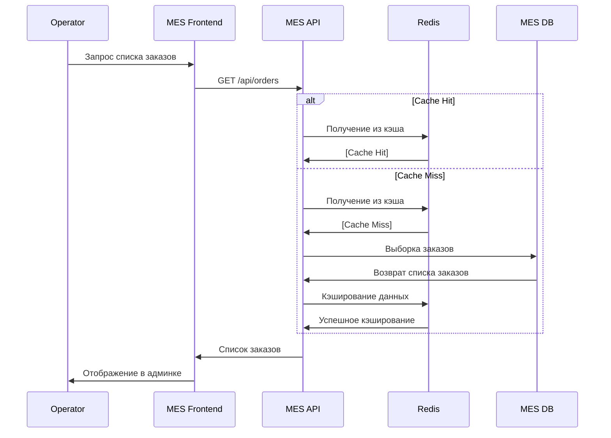
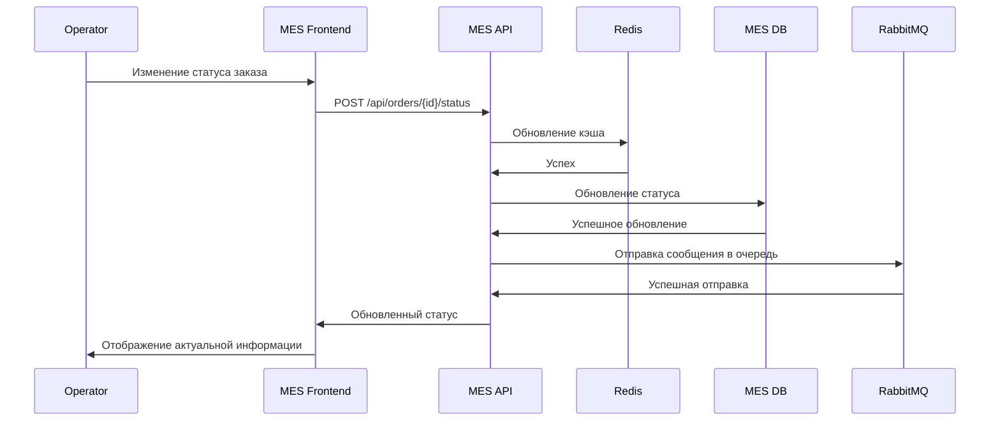

# Архитектурное решение по кешированию

## Мотивация

Так ка страница со списком заказов очень долго грузится, требуется добавить возможность кэширования, для того, чтобы можно было отдавать ответ от сервера быстрее и время обработки заказов клиентов не было долгим
Без кэша имеем:

- Медленная загрузка страницы со списком заказов
- Высокая нагрузка на БД при отображении данных
- Потери клиентов как в сегменте B2C, так и в сегменте B2B
- Неэффективная работа операторов

## Предлагаемое решение

### Клиентская часть

- Кэшировать статические файлы: картинки, js, css и тп
- Кэшировать ответы от ручек, которые возвращают при одних и тех же параметрах - один и тот же ответ

### Серверная часть

- Кэширование ответов от ручек
- Кэширование расчетов стоимости

### Паттерн

Для редкоизменящихся данных от ручек API будем использовать паттерн Cache-Aside, так как он прост в реализации, устойчив к сбоям в кэше и гибок в управлении данными, например для списка заказов у клиента, а также список заказов для операторов
Для данных связанных со статусами заказа будем использовать паттерн Write Through, так как он нам позволит держать в кэше актуальные статусы заказов и операторы смогут брать заказы в соответстующем статусе, из минусов, возможна избыточная синхронизация для редко изменяемых данных

### Стратегия инвалидации кеша

Для инвалидации будем использовать TTL, для ручек, у которых выбрана стратегия кэширования Cache-Aside ~10 мин, для расчетов стоимости ~30 мин, для Write Through стратегии ~5 мин
Также при стратегии Write Through - нужно добавить "Персистентность", чтобы в случае проблем с кэшом, была возможность его восстановления с жесткого диска

### Схема работы при запросе стратегии Cache-Aside

### Схема работы при запросе стратегии Write-Aside

